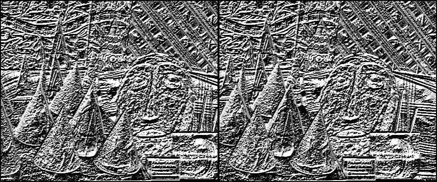
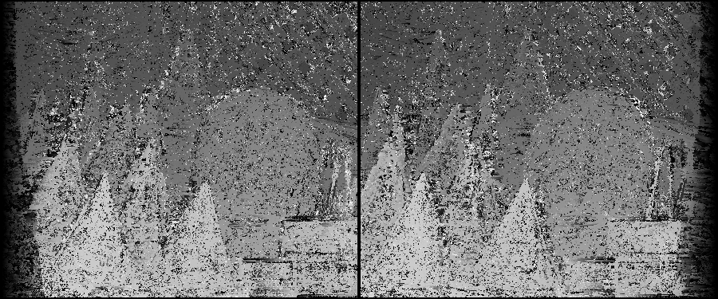
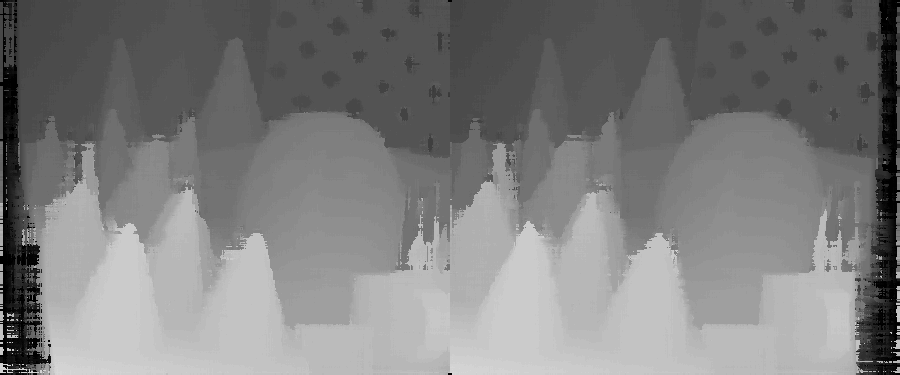
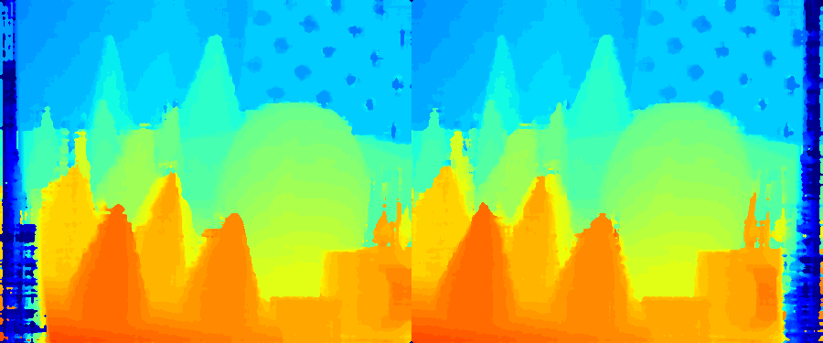

# Semi-Global Matching Numpy

## Introduction
This is a reimplementation of the Semi-Global Matching algorithm using numpy. Both a python script and jupyter notebook is provided implementing SGM. The notebook provides visualizations and explanations for each step in the process.

## SGM Brief Description
SGM is a popular classic depth estimation algorithm, known for having good accuracy for its speed. Its widely used in resource constrained  situations.

## Requirements
All you need to run the SGM algorithm are a pair of rectified stereo images. Stereo pair examples from the Middlebury dataset are provided for you (cones, figures and teddy). If you would like to review the algorithms accuracy you need groundtruth disparities. 

If you would like to use your own stereo images and your stereo camera doesn't provide rectified stereo pairs, then you can calibrate your stereo camera using the methods shown in this repo: [stereo-camera-calibration](https://github.com/ChristianOrr/stereo-camera-calibration).

If you would like to try more advanced deep learning stereo depth estimation techinques check out [madnet-deep-stereo-with-keras](https://github.com/ChristianOrr/madnet-deep-stereo-with-keras).

The python packages needed are shown in the requirements.txt.

## SGM Transformation Process
The SGM algorithm follows the following process to achieve the depth estimation prediction. Head over to the sgm_numpy_notebook if you would like to see how its done in code.

1. The SGM process starts with a pair of rectified stereo images. 

2. The stereo pair is converted to grayscale.

3. A Gaussian blur filter is applied to smooth the images.

4. The census transform is then applied to the images.

5. The Hamming distance is applied to the census values to calculate the cost volume.

6. A cost aggregation technique is applied to remove the noise from the cost volume.

7. A median blur filter is applied to remove the streaking.

8. **Optional:** The disparity can then be converted to colour to see the depth better. Red indicates closer and blue further away.

## References
* [Previous SMG Implementation in Python](https://github.com/beaupreda/semi-global-matching), by David-Alexandre Beaupre.
* [(SGM) Stereo Processing by Semi-Global Matching and Mutual Information](https://core.ac.uk/download/pdf/11134866.pdf), by Heiko Hirschmuller.
* [(Census) Nonparametric Local Transforms for Computing Visual Correspondence](http://www.cs.cornell.edu/~rdz/Papers/ZW-ECCV94.pdf), by R Zabih and J Woodfill.